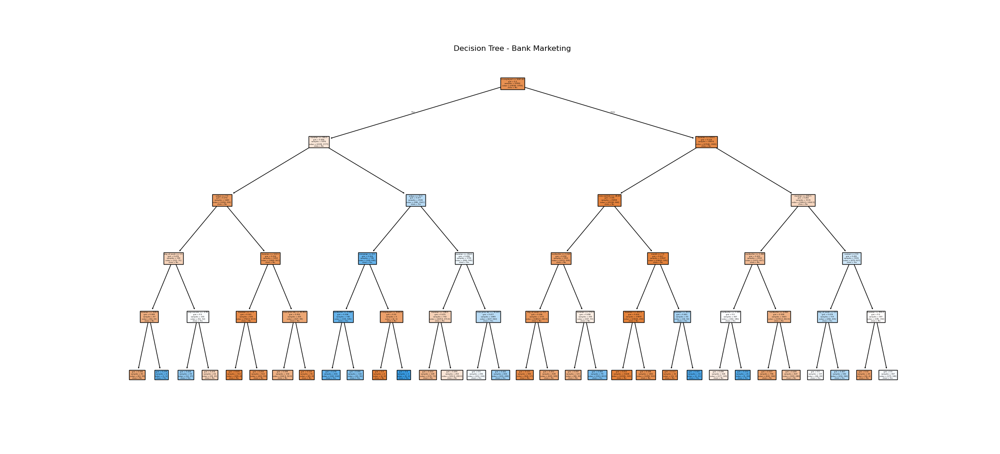

# PRODIGY_DS_03
# 📊 Bank Marketing Decision Tree Classifier

This project uses the **Bank Marketing dataset** from the [UCI Machine Learning Repository](https://archive.ics.uci.edu/ml/datasets/Bank+Marketing) to predict whether a customer will **subscribe to a term deposit** (`y`).

We implemented a **Decision Tree Classifier** using `scikit-learn`, trained it on customer demographic and behavioral data, and evaluated the model using standard classification metrics.

---

## ✅ Workflow Summary

- 📥 Downloaded and extracted the UCI dataset
- 🧼 Preprocessed data (handled categorical encoding)
- ✂️ Split into training and testing sets
- 🌳 Trained a `DecisionTreeClassifier` (max_depth=5)
- 📊 Evaluated model accuracy, precision, recall, F1-score
- 📈 Visualized the trained decision tree

---

## 📉 Model Performance

- **Accuracy**: `0.9149`
- **Classification Report**:

          precision    recall  f1-score   support

       0       0.94      0.96      0.95      7303
       1       0.65      0.54      0.59       935

accuracy                           0.91      8238

---

## 🌳 Decision Tree Visualization

## 🛠️ Libraries Used

- `pandas`, `numpy`, `matplotlib`, `seaborn`
- `scikit-learn` for modeling & metrics
